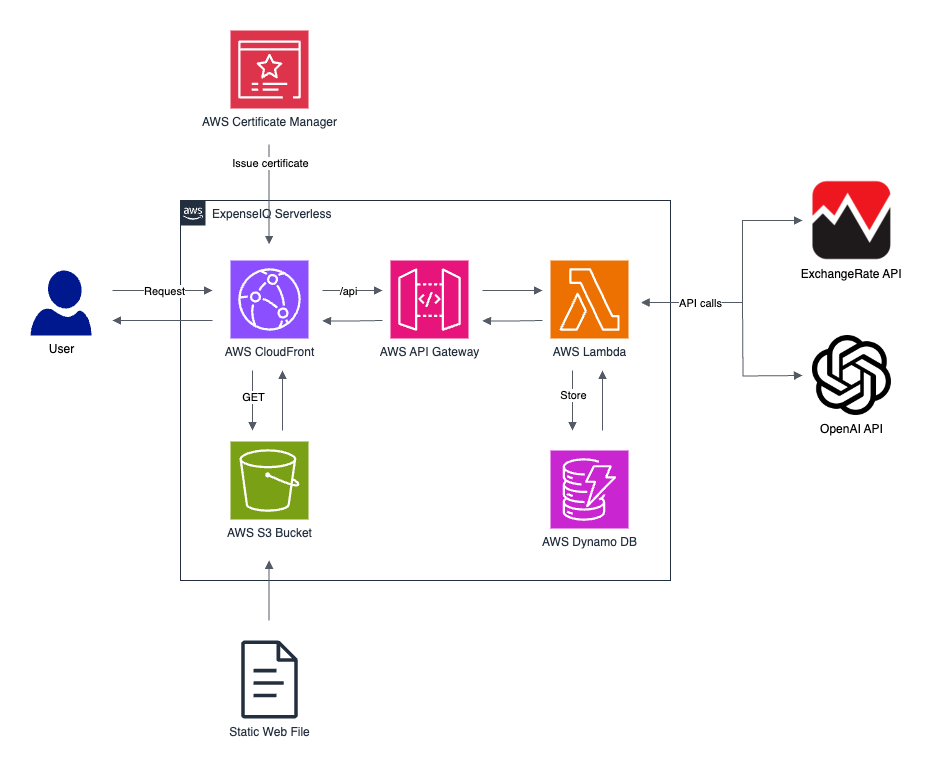

# Introduction

Effective financial management remains a pivotal yet challenging endeavour for many young adults, including myself. Responsible spending is undeniably crucial, as it not only fuels economic growth but also reflects personal financial health. However, habitual overspending is a clear indicator of suboptimal financial planning. This behaviour can deplete essential reserves meant for emergencies or future investments, consequently trapping individuals in a precarious cycle of living paycheck to paycheck.

The dangers of an unchecked lifestyle that exceeds one's financial means are profound. Without timely recognition and intervention, the habit of excessive spending becomes deeply ingrained, making it increasingly difficult to reverse. Such patterns, if not addressed, are likely to lead to a cascade of poor financial decisions, potentially derailing long-term financial stability and success. Therefore, it is imperative for young adults to cultivate financial literacy and discipline as early as possible to secure a sound financial future.

---

# Introducing ExpenseIQ: An AI powered spending tracker

ExpenseIQ is a specialised Spending-Tracker-as-a-Service (STaaS) powered by artificial intelligence, designed to streamline the process of recording expenditures. This innovative service simplifies expense tracking by allowing users to describe their purchases in full simple sentences. Upon receiving this information, ExpenseIQ promptly categorises each expense, generates a summary description, and accurately records the amount spent. It also features an automatic currency conversion to Singapore Dollars (SGD) using real-time exchange rates.

Unlike traditional expense trackers, which require manual input of each transaction's details—a process often tedious and prone to inaccuracies—ExpenseIQ automates these steps, significantly improving the accuracy and efficiency of personal finance management. This automation is particularly advantageous as it avoids the common pitfalls of manual entry that deter sustained user engagement.

Furthermore, distinct from other applications, ExpenseIQ focuses exclusively on monitoring outflows without tracking income. This unique approach helps users maintain a realistic perspective on their spending levels, by not offsetting expenses with income, which can often lead to underestimating one's spending.

ExpenseIQ not only logs each transaction but also analyses spending patterns to provide users with insightful statistics. These statistics aim to illuminate the total expenditure over time and motivate users towards more mindful spending habits, ultimately helping them to reduce unnecessary expenses.

To enhance user accessibility, ExpenseIQ has been meticulously developed with responsive web design, ensuring a seamless and user-friendly experience across all devices, particularly mobile. Additionally, the application is crafted as a Progressive Web App (PWA), allowing mobile users the convenience of accessing ExpenseIQ directly through an app icon, bypassing the need for a web browser. This approach not only streamlines user interaction but also significantly improves accessibility and engagement.

---

## Technology & Architecture

### Tech Stack

-   **Frontend**:
    -   **Framework:** ReactJS
        -   Utilizes ReactJS to build a dynamic and responsive user interface.
    -   **Hosting:** AWS S3 bucket
        -   Static web hosting in an AWS S3 bucket, providing a scalable and reliable solution.
-   **Backend API**:
    -   **API Management:** AWS API Gateway
        -   Manages API requests and routes them to the appropriate AWS Lambda functions.
    -   **Serverless Function:** AWS Lambda (Python3)
        -   Serverless backend architecture using AWS Lambda, programmed in Python3, allows for efficient scaling and reduced operational costs.
-   **Database**:
    -   **Storage:** AWS DynamoDB
        -   Employs AWS DynamoDB for persistent data storage, offering fast and flexible NoSQL database service with seamless scalability.
-   **Content Delivery and Security**:
    -   **CDN:** AWS CloudFront
        -   Content delivery is accelerated through AWS CloudFront, ensuring low latency and high data transfer speeds worldwide.
    -   **SSL/TLS Management:** AWS Certificate Manager
        -   Implements SSL/TLS certificates managed by AWS Certificate Manager to secure server-client communications.

### Application flow

When a user submits a request to the ExpenseIQ API, the request is forwarded to OpenAI's `GPT-3.5 Turbo` to extract relevant information and format it into a specified JSON structure. If the request involves any foreign currency, a call is made to the ExchangeRate API to convert the currency into Singapore Dollars (SGD). These processed values are then stored in DynamoDB for future reference.

To optimise computational costs, all calculations and data processing occur on the user's client device rather than on our cloud infrastructure. The primary role of our AWS Lambda function is to ensure correctness and reliable data storage and retrieval from DynamoDB. This architecture not only enhances performance but also ensures user data is processed locally, maximising privacy and efficiency.

---

### Cloud Architecture Diagram

Serverless architecture is the optimal choice for ExpenseIQ, given the application's relatively small scale. This architecture enables a focus on developing the application without the need to manage infrastructure-related issues such as resource scaling and redundancy. These aspects are efficiently handled by AWS, allowing for seamless operation. In contrast to the continuous operation and associated costs of using virtual machines (VMs) that need to run 24/7 in the cloud, serverless services incur costs only when requests are made. This results in minimal running costs for the application, often close to zero, making it a cost-effective solution for maintaining and scaling the service.

---

## Future Improvement

ExpenseIQ is still very early in its development stage, hence many improvement can be made. Some immediate improvement to be made is for users to be able to edit transactions that is either identified wrongly or dated wrongly, as well as to delete incorrect transactions. Another good feature to be implemented is to have a more sophisticated reporting where it gives users greater insights their spendings.

Transaction Management Enhancements

-   Editing Transactions:
    -   Purpose: Allow users to modify details of transactions that have been incorrectly identified or dated.
    -   Impact: This feature will enhance user satisfaction by providing greater control over their financial data, ensuring accuracy and relevance of the information displayed.
-   Deleting Transactions:
    -   Purpose: Enable users to remove transactions that are entered by mistake or no longer relevant.
    -   Impact: Improving data integrity and user trust, as users can maintain cleaner and more accurate financial records.

Advanced Reporting Features

-   Sophisticated Reporting Tools:
    -   Purpose: Implement advanced reporting capabilities that offer deeper insights into spending patterns and financial habits.
    -   Impact: By providing more detailed and customisable reports, users can gain better understanding and management of their finances, potentially leading to more informed financial decisions

---

# Conclusion

In conclusion, ExpenseIQ emerges as a transformative tool in the realm of personal finance management, blending sophisticated AI technology with user-centric design. By automating the intricate process of expense tracking, it not only eliminates the common errors associated with manual data entry but also enriches the user experience with its intuitive and responsive interface. The exclusive focus on tracking expenditures, without the distraction of income recording, provides users with a clear view of their financial outflows, encouraging more responsible spending behaviours.

The underlying technology stack, comprising ReactJS, AWS services, and serverless architecture, ensures that ExpenseIQ is not only robust and scalable but also cost-effective and efficient. The application's design as a Progressive Web App enhances accessibility, making it as convenient as native applications with the added benefits of web-based flexibility.

Looking ahead, the potential for enhancements such as transaction editing and advanced reporting features promises to make ExpenseIQ even more indispensable to its users. By continuously evolving and adapting to user needs, ExpenseIQ is well-positioned to set a new standard in the financial tech landscape, helping users navigate their financial journeys with greater ease and insight. As it stands, ExpenseIQ represents a significant step forward in making personal finance management both accessible and engaging.

Demo: https://expenseiq.astary.one/
